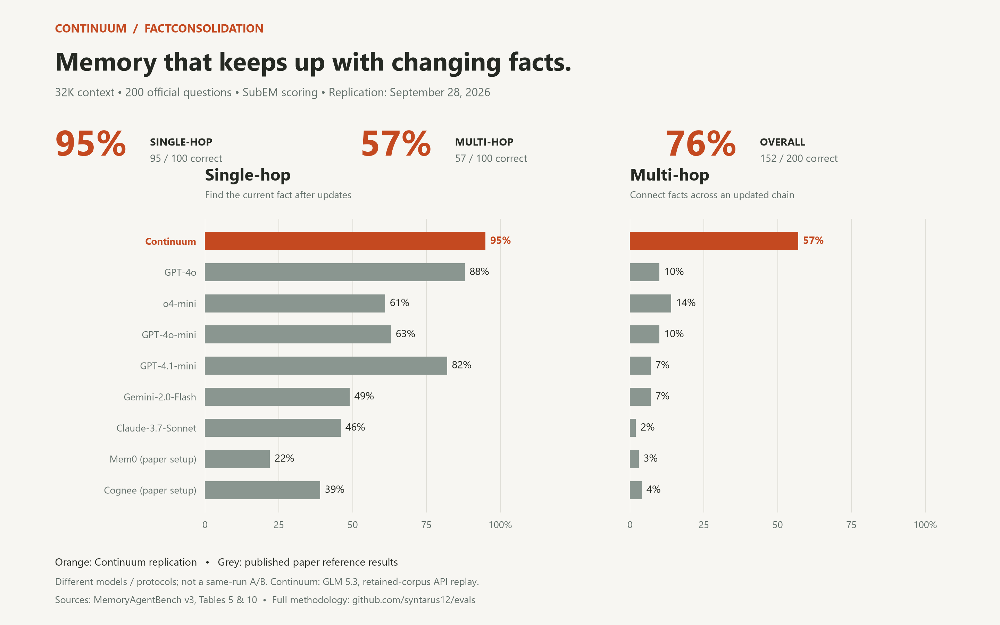

# Continuum — FactConsolidation evaluation

This repository publishes an auditable Continuum-only live production API evaluation on the official FactConsolidation 32K Single-Hop (SH) and Multi-Hop (MH) subsets from [MemoryAgentBench](https://github.com/HUST-AI-HYZ/MemoryAgentBench).

## Latest verified full replication

Run: **September 28, 2026**. Offline artifact verification: **October 1, 2026**.

| Subset | Correct | Questions | Accuracy |
|---|---:|---:|---:|
| Single-Hop (SH) | 95 | 100 | **95%** |
| Multi-Hop (MH) | 57 | 100 | **57%** |
| Overall | 152 | 200 | **76%** |

### 32K paper-reference comparison



Continuum's verified replication is **95% SH / 57% MH / 76% overall**. The earlier **97% / 43% / 70%** publication remains historical, not the current headline. The offline verifier now checks this headline table as well as the underlying predictions and summaries.

The chart uses only the **32K FactCon** columns from MemoryAgentBench v3, Tables 5 and 10. Paper bars are published reference results, **not our reruns or a same-model A/B**; Mem0 and Cognee denote the paper's configurations, not today's hosted APIs. Continuum used GLM 5.3 and a retained-corpus API replay. [Exact chart data and sources](assets/FACTCON_32K_SOURCES.md) · [Copy-ready X thread](X_THREAD.md).

To regenerate the image (optional; offline verification still needs no dependencies):

```bash
python -m pip install -r requirements-figures.txt
python -B scripts/render_factcon_32k.py
```

All 200 official questions appear exactly once. The replication records **zero failed question requests**, one answer attempt per retained question, and no recorded answer retries. Scores were independently recomputed from the checksum-locked official answers instead of trusted from stored flags or embedded gold. GLM 5.3 through Sarvam v2 was the answerer (temperature 0, 512-token budget); scoring is official normalized substring exact match (SubEM), **not an LLM judge**.

**Important scope:** this is a Continuum-only retained-corpus replay through the public Syntarus API, not a fresh ingestion trial, competitor comparison, independent certification or vendor-neutral leaderboard. The same benchmark was used during engine development; these results do not establish generalization to unseen customer workloads.

The replay reused a namespace reportedly loaded with the official 2,310-fact stream. It made zero new fact writes, did not delete the corpus, and did not fully inventory it. Both newer artifacts are marked as resumed; their retained attempt counts do not reconstruct every preflight or discarded/incomplete invocation.

### Published run history

| Run | SH | MH | Overall | Failed questions |
|---|---:|---:|---:|---:|
| September 27 — previous publication | 97/100 | 43/100 | 140/200 (70%) | 0 |
| September 28 — initial replay | 95/100 | 58/100 | 153/200 (76.5%) | 1 |
| September 28 — latest full replication | **95/100** | **57/100** | **152/200 (76%)** | **0** |

The headline uses the subsequent replication, not the highest-scoring replay. Failures stay in the denominators. Compared with the previous publication: 14 more MH answers, 2 fewer SH answers. Different builds and reused/resumed-run conditions prevent attributing the change to one modification. [Previous results](results/archive/2026-09-27/) and [initial replay results](results/replays/) are preserved.

A later paired MH-only experiment scored **57/100 for the default resolver versus 34/100 for an opt-in chain canary**. That regression is disclosed separately in [EXPERIMENTS.md](EXPERIMENTS.md).

### Observed replication latency

| Measurement | Median (p50) | p95 |
|---|---:|---:|
| Reported retrieval server time | 530 ms | 1,009 ms |
| Complete memory API round trip | 959 ms | 2,865 ms |
| External answer-model attempt | 933 ms | 4,937 ms |
| Question end-to-end | 2,565 ms | 6,385 ms |

These observations are not an SLA. The API round trip includes network and resolver processing; the external answerer is separate. Ingestion was not measured. The recorded 693.6-second timer belongs to the final resumed scoring invocation, not a verified full-run wall-clock duration.

See [METHODOLOGY.md](METHODOLOGY.md) for the full protocol, latency breakdown, evidence-stage diagnostic, comparison caveats, and limits.

## Inspect and reproduce

The published results are sanitized: no API credentials, user/namespace identifier, provider event IDs, raw state cards, or raw API responses are included.

Python 3.10+ is sufficient for the offline checks; they need no third-party dependencies, credentials or paid API calls:

```bash
python -B scripts/score_factconsolidation.py
python -B scripts/verify_result_artifacts.py
python -B -m unittest discover -s tests -v
python -B scripts/verify_public_release.py
```

The artifact verifier recomputes all five published result sets, checks question identities, failures, summary totals and file hashes in [RESULTS_MANIFEST.json](results/RESULTS_MANIFEST.json). These commands work in PowerShell too. Git attributes preserve LF line endings so the locked fixture has identical bytes on Windows and Unix.

A fresh live run is optional and potentially paid; it is not needed to verify these artifacts. It writes 2,310 ordered facts into a new empty synthetic namespace, waits for durable completion, then makes 200 Sarvam answer calls plus a connectivity preflight. Estimate and cap ingestion/model costs first; it can take several hours. Never commit credentials:

```bash
python -m pip install -r requirements-live.txt
export SYNTARUS_API_KEY="your-project-key"
export SARVAM_API_KEY="your-Sarvam-key"
python scripts/run_live_factconsolidation.py \
  --user-id "factcon_eval_use-a-new-random-id" \
  --expected-build "YOUR_VERIFIED_PRODUCTION_BUILD_SHA" \
  --output local_runs/my_run_predictions.json
```

On PowerShell, set credentials with `$env:SYNTARUS_API_KEY` and `$env:SARVAM_API_KEY` in the current terminal before running the script. The harness refuses a non-empty namespace and does not delete data. Choose a fresh synthetic user ID, keep local outputs private, and use a new ID if an interrupted run left partial data.

The published replication targeted `cb093372018957b672cd5d08f34d60a33ae3fe00`. A current deployment may differ: verify the approved deployment, pass its build explicitly and report a fresh test separately. Another build does not reproduce the historical service snapshot.

## Repository map

- `fixtures/factconsolidation_official_32k.json` — checksum-locked upstream fixture.
- `fixtures/BENCHMARK_LOCK.json` — upstream revision, fixture hash, subsets, and scoring contract.
- `results/factconsolidation_summary.json` — latest run configuration, score, latency, and reuse disclosures.
- `results/factconsolidation_predictions_full.json` — 200 sanitized question/prediction/gold-answer/score records.
- `results/factconsolidation_mh_stage_audit.json` — 100-question MH evidence-stage classification and its limitations.
- `scripts/run_live_factconsolidation.py` — standalone live public-API harness for fresh runs.
- `scripts/score_factconsolidation.py` — dependency-free SubEM scorer.
- `scripts/harness_template.py` — adapter scaffold for evaluating another system under a separately documented protocol.
- `scripts/verify_public_release.py` — checks common secret patterns and prohibited artifact paths.
- `scripts/verify_result_artifacts.py` — independently rescores every published result and checks summaries and manifest hashes.
- `results/RESULTS_MANIFEST.json` — prediction/summary hashes for all five published result sets.
- `results/archive/2026-09-27/` — preserved previous publication.
- `results/replays/` — preceding full replay, including its failed question.
- `EXPERIMENTS.md` and `results/experiments/` — paired MH experiment, including its regression and failure.
- `METHODOLOGY.md` — detailed run methodology and interpretation.

All 200 latest predictions are available [here](results/factconsolidation_predictions_full.json), including incorrect answers. The private engine implementation is not included. Automated secret scanning supplements review and cannot detect every possible secret format.

## Dataset attribution

FactConsolidation is from [MemoryAgentBench](https://github.com/HUST-AI-HYZ/MemoryAgentBench), dataset card [ai-hyz/MemoryAgentBench](https://huggingface.co/datasets/ai-hyz/MemoryAgentBench). Refer to the upstream project and dataset card for their terms and citation requirements. Repository code and authored result summaries are licensed under [MIT](LICENSE).
